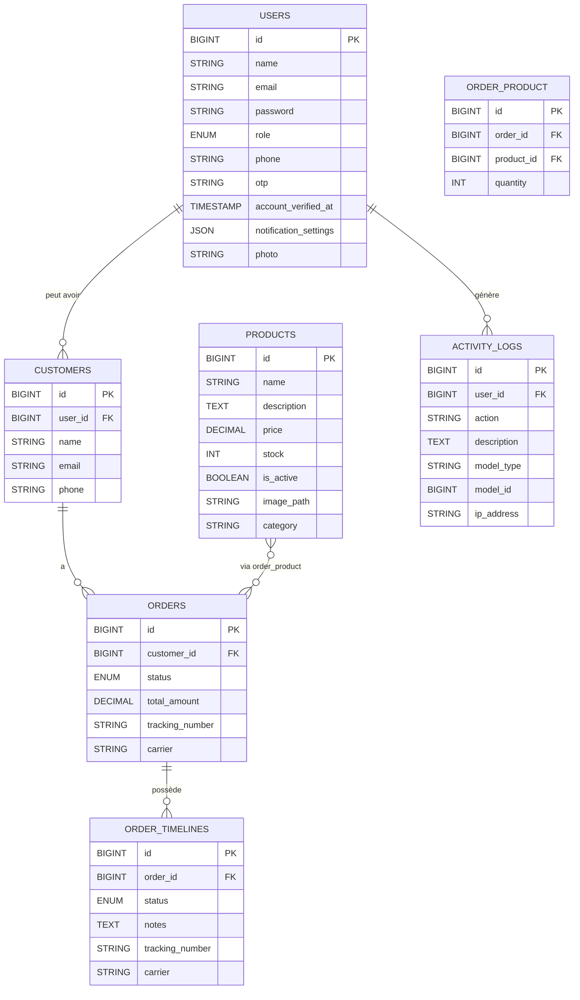
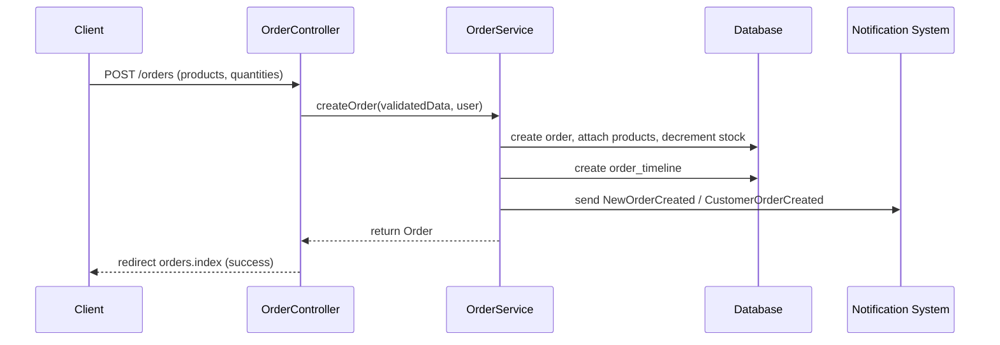

#!/usr/bin/env text

# Mini Order Management System (OMS)

Version finale de la documentation technique et fonctionnelle rédigée en français.

Cette documentation est exhaustive et destinée à servir de source unique pour générer un rapport de fin d’études (PFE) ou pour déployer, maintenir et faire évoluer l'application. Elle couvre l'analyse technique, l'architecture, la structure du code, la base de données, la logique métier, la sécurité, les scénarios utilisateurs, les workflows, le déploiement et des recommandations d'amélioration.

---

## Table des matières

1. [Introduction Générale](#introduction-générale)
2. [Présentation du Projet](#présentation-du-projet)
3. [Présentation de l’Entreprise (profil générique)](#présentation-de-lentreprise-profil-générique)
4. [Technologies Utilisées](#technologies-utilisées)
5. [Architecture du Projet](#architecture-du-projet)
6. [Structure du Projet — Fichiers &amp; Dossiers importants](#structure-du-projet--fichiers--dossiers-importants)
7. [Analyse Fonctionnelle](#analyse-fonctionnelle)
   - [Espace Administrateur](#espace-administrateur)
   - [Espace Client](#espace-client)
   - [Authentification](#authentification)
   - [Gestion des Commandes (lifecycle)](#gestion-des-commandes-lifecycle)
   - [Notifications et Emails](#notifications-et-emails)
8. [Analyse Technique](#analyse-technique)
9. [Base de Données](#base-de-données)
10. [Sécurité](#sécurité)
11. [Interfaces Utilisateur (vues &amp; composants)](#interfaces-utilisateur-vues--composants)
12. [Workflow Global (scénarios)](#workflow-global-scénarios)
13. [Difficultés Rencontrées](#difficultés-rencontrées)
14. [Solutions Apportées](#solutions-apportées)
15. [Optimisations et Améliorations proposées](#optimisations-et-améliorations-proposées)
16. [Déploiement](#déploiement)
17. [Conclusion Générale](#conclusion-générale)
18. [Bibliographie &amp; Références](#bibliographie--références)
19. [Annexes (fichiers clés)](#annexes-fichiers-clés)

---

## Introduction Générale

- Contexte

  Le projet "Mini Order Management System" (OMS) est une application web développée avec le framework Laravel pour centraliser la gestion des produits, des clients et du cycle de vie des commandes. L'application vise à fournir aux petites structures commerciales un outil simple mais complet pour traiter les commandes, gérer les stocks, générer des factures et produire des rapports opérationnels.
- Problématique

  De nombreuses PME gèrent encore les commandes manuellement (spreadsheets, emails, appels). Cette organisation provoque des pertes de traçabilité, des erreurs de stock, des retards de communication avec le client et un manque d'indicateurs décisionnels (CA, top produits, état des commandes). L'OMS répond à ces besoins en automatisant l'essentiel du processus et en fournissant des outils d'analyse et de notification.
- Objectifs

  - Centraliser les commandes, le catalogue produit et la gestion client.
  - Assurer l'intégrité des stocks au moment de la création et de l'annulation des commandes.
  - Historiser chaque changement de statut (timeline) pour assurer traçabilité et audit.
  - Notifier automatiquement les acteurs (admin, staff, client) par e-mail et notifications en base.
  - Offrir des mécanismes d'export (Excel) et d'impression (PDF) des documents (invoices).
- Contexte de transformation digitale

  L'OMS est positionné comme une solution permettant à une PME de franchir une étape de transformation digitale opérationnelle : migration des processus manuels vers une application centralisée, amélioration du service client (notifications et factures), visibilité sur les performances commerciales.

## Présentation du Projet

- Description

  L'application implémente les fonctionnalités suivantes : gestion de comptes utilisateurs (admin, staff, customer), CRUD produits, CRUD clients, création et suivi des commandes (multi-produits, quantités), timeline par commande, export Excel, génération de facture PDF, dashboard métriques, notifications (mail + en base) et API JSON pour tableau de bord et notifications.
- Fonctionnalités principales

  - Authentification et vérification par OTP (email/phone) — inscriptions, connexion, réinitialisation.
  - Gestion des utilisateurs et profils (photo, paramètres de notification).
  - Gestion produits : catégories, images, prix, stock et état actif/inactif.
  - Gestion clients : profils liés au compte utilisateur (relation 1:1 facultative via `user_id`).
  - Gestion commandes : ajout de produits avec quantités, calcul du total, gestion du statut, timeline, tracking, réapprovisionnement automatique lors d'annulation.
  - Dashboard : indicateurs (nombre commandes, CA, top produits, graphiques sur 7 jours).
  - Exports et impressions : Excel (`Maatwebsite/Excel`) et PDF (`barryvdh/laravel-dompdf`).
- Utilisateurs cibles

  - `admin` : accès complet, gestion produits, clients, commandes, exports, métriques.
  - `customer` : espace client pour créer et suivre ses commandes, télécharger factures.
- Valeur métier

  Réduction des erreurs de traitement, meilleure communication client (confirmation / mises à jour), traçabilité des opérations, capacité d'analyses commerciales via dashboard et exports.

## Présentation de l’Entreprise (profil générique)

La solution s'adresse à une PME commerciale (vente au détail ou distribution). Exemples d'usage : boutique locale, grossiste, société de services avec facturation par commande. L'entreprise typique possède un responsable (admin), une équipe d'exécution (staff) et des clients finaux.

## Technologies Utilisées

Le jeu de technologies a été identifié automatiquement dans le code source et les fichiers manifestes. Le tableau ci-dessous liste le rôle et les versions détectées.

| Technologie             | Rôle                        | Avantages                                          |                                   Version détectée |
| ----------------------- | ---------------------------- | -------------------------------------------------- | ---------------------------------------------------: |
| PHP                     | Langage applicatif backend   | Mature, performant, vaste écosystème             |                                 ^8.2 (composer.json) |
| Laravel                 | Framework MVC back-end       | Patterns éprouvés, Eloquent ORM, sécurité, CLI |                                ^12.0 (composer.json) |
| MySQL / SQLite          | Stockage relationnel         | Fiable, support transactions                       | Default db (`DB_CONNECTION` dans `.env.example`) |
| Composer                | Gestion dépendances PHP     | Standard pour PHP                                  |                        — (manifest : composer.json) |
| Node.js & NPM           | Build frontend               | Outils modernes (Vite)                             |                                    — (package.json) |
| Vite                    | Bundler & dev server         | Rapide, HMR, intégration Laravel                  |                                ^7.3.1 (package.json) |
| Tailwind CSS            | Bibliothèque CSS utilitaire | Productivité UI, thèmes faciles                  |                                ^4.2.2 (package.json) |
| Axios                   | Requêtes HTTP côté client | Simple, large adoption                             |                               ^1.11.0 (package.json) |
| laravel-vite-plugin     | Intégration Vite + Laravel  | Facilite chargement d'assets                       |                                ^2.1.0 (package.json) |
| Maatwebsite/Excel       | Export Excel                 | Exports rapides et robustes                        |                                 ^3.1 (composer.json) |
| barryvdh/laravel-dompdf | Génération PDF             | Production de factures PDF                         |                                 ^3.1 (composer.json) |
| PHPUnit                 | Tests unitaires              | Intégration CI, TDD                               |                             ^11.5.50 (composer.json) |

Remarques : des dépendances de développement (laravel/pint, nunomaduro/collision, mockery) sont présentes et facilitent les tests et la qualité du code.

## Architecture du Projet

- Pattern principal : MVC (Model — View — Controller) avec des couches additionnelles : Services, Events/Listeners et Notifications.
- Rôles des couches :

  - Routes (routes/web.php) : point d'entrée HTTP (pages & endpoints API).
  - Controllers (app/Http/Controllers) : orchestration des requêtes, validation et délégation vers Services.
  - Services (app/Services) : logique métier transactionnelle et opérations lourdes (création de commande, gestion stock, uploads).
  - Models (app/Models) : représentation des entités et relations via Eloquent.
  - Views (resources/views) : rendu côté serveur avec Blade (layouts, pages, partials, emails).
- Diagramme d'architecture (flux simplifié)

```mermaid
flowchart LR
  Routes[Routes (web.php)] --> Controllers[Controllers]
  Controllers --> Services[Services (OrderService, ...)]
  Services --> Models[Models (Eloquent)]
  Models --> DB[(Base de données)]
  Controllers --> Views[Views (Blade)]
  Events --> Listeners
  Listeners --> Notifications
  Notifications --> Mail[Mail Channel]
  Notifications --> DBNotifications[Database Channel]
```

### Observations architecturales

- Couche `Services` : permet de centraliser la logique mutative (ex : `app/Services/OrderService.php`) et faciliter les tests unitaires.
- Use d'Events/Listeners : à l'inscription (`UserRegistered` → `CreateCustomerProfile`) pour création automatique du profil client et notification aux admins.
- Policies + Middleware : autorisations au niveau des modèles (app/Policies) et middleware pour vérifier les rôles (`app/Http/Middleware/RoleMiddleware.php`).

## Structure du Projet — Fichiers & Dossiers importants

Ci-dessous le rôle des principaux répertoires et fichiers (liens workspace-relatifs) :

- Racine

  - [composer.json](composer.json) — dépendances backend et scripts `composer`.
  - [package.json](package.json) — dépendances frontend (Vite, Tailwind, Axios).
  - [routes/web.php](routes/web.php) — définition de toutes les routes web (pages + API endpoints).
- `app/Models`

  - [app/Models/User.php](app/Models/User.php) — modèle utilisateur (rôles, casts `password` hashed, `notification_settings`).
  - [app/Models/Customer.php](app/Models/Customer.php) — profil client (relation `user_id`, `orders`).
  - [app/Models/Product.php](app/Models/Product.php) — produit (prix, stock, image_path, is_active, category).
  - [app/Models/Order.php](app/Models/Order.php) — commandes : statuts, transitions autorisées, calcul total, timeline, relations.
  - [app/Models/OrderTimeline.php](app/Models/OrderTimeline.php) — historique d'état d'une commande.
  - [app/Models/ActivityLog.php](app/Models/ActivityLog.php) — table d'audit écrite par `LogsActivity` trait.
- `app/Http/Controllers`

  - Auth controllers : [RegisterController](app/Http/Controllers/Auth/RegisterController.php), [LoginController](app/Http/Controllers/Auth/LoginController.php), [ResetPasswordController](app/Http/Controllers/Auth/ResetPasswordController.php), [VerifyAccountController](app/Http/Controllers/Auth/VerifyAccountController.php), [UpdateProfileController](app/Http/Controllers/Auth/UpdateProfileController.php), [UpdateNotificationSettingsController](app/Http/Controllers/Auth/UpdateNotificationSettingsController.php).
  - `OrderController` : gestion complète des commandes (création, édition, exports, invoice) — [app/Http/Controllers/OrderController.php](app/Http/Controllers/OrderController.php).
  - `ProductController`, `CustomerController` pour les entités correspondantes.
  - API controllers : [app/Http/Controllers/Api/DashboardApiController.php](app/Http/Controllers/Api/DashboardApiController.php), [app/Http/Controllers/Api/NotificationApiController.php](app/Http/Controllers/Api/NotificationApiController.php).
- `app/Services`

  - [app/Services/OrderService.php](app/Services/OrderService.php) — création transactionnelle des commandes, gestion stock, notifications et timeline.
  - [app/Services/ProductService.php](app/Services/ProductService.php) — gestion des images produits, suppression et bulk delete.
  - [app/Services/CustomerService.php](app/Services/CustomerService.php) — création/édition/suppression de clients.
- `app/Notifications` et `app/Mail`

  - Notifications : `NewOrderCreated`, `CustomerOrderCreated`, `OrderStatusUpdated`, `NewCustomerRegistered` (canaux `mail` et `database`).
  - Mailables : [app/Mail/VerifyAccountMail.php](app/Mail/VerifyAccountMail.php), [app/Mail/SendResetLinkMail.php](app/Mail/SendResetLinkMail.php).
- `app/Policies` — règles d'autorisation par modèle : [app/Policies/OrderPolicy.php](app/Policies/OrderPolicy.php), [app/Policies/ProductPolicy.php](app/Policies/ProductPolicy.php), [app/Policies/CustomerPolicy.php](app/Policies/CustomerPolicy.php).
- `app/Http/Middleware`

  - [app/Http/Middleware/RoleMiddleware.php](app/Http/Middleware/RoleMiddleware.php) — middleware paramétrable `role:admin,staff`.
  - [app/Http/Middleware/SetLocale.php](app/Http/Middleware/SetLocale.php) — applique `session('locale')`.
- `database/migrations` — fichiers de création et d'évolution du schéma (ex. create_users_table, create_customers_table, create_products_table, create_orders_table, create_order_product pivot, create_order_timeline) :

  - [database/migrations/0001_01_01_000000_create_users_table.php](database/migrations/0001_01_01_000000_create_users_table.php)
  - [database/migrations/2026_03_31_185451_create_customers_table.php](database/migrations/2026_03_31_185451_create_customers_table.php)
  - [database/migrations/2026_03_31_221114_create_products_table.php](database/migrations/2026_03_31_221114_create_products_table.php)
  - [database/migrations/2026_03_31_223022_create_orders_table.php](database/migrations/2026_03_31_223022_create_orders_table.php)
  - [database/migrations/2026_04_01_093527_create_order_product_table.php](database/migrations/2026_04_01_093527_create_order_product_table.php)
  - [database/migrations/2026_04_01_093528_create_order_timeline_table.php](database/migrations/2026_04_01_093528_create_order_timeline_table.php)
- `resources/views` — templates Blade (layouts, emails, admin/customer pages) :

  - [resources/views/layouts/app.blade.php](resources/views/layouts/app.blade.php) — layout principal.
  - [resources/views/dashboard.blade.php](resources/views/dashboard.blade.php) — tableau de bord.
  - Emails : [resources/views/emails/order-confirmation.blade.php](resources/views/emails/order-confirmation.blade.php), [resources/views/emails/admin-new-order.blade.php](resources/views/emails/admin-new-order.blade.php).

## Analyse Fonctionnelle

Cette section décrit chaque fonctionnalité en détail, les pages impliquées et les blocs de code correspondants.

### Espace Administrateur

L'espace administrateur permet :

- Gestion des clients (CRUD) via `CustomerController` : [app/Http/Controllers/CustomerController.php](app/Http/Controllers/CustomerController.php). La page liste supporte recherche, tri et affiche des statistiques par client (total commandes, montant total dépensé).
- Gestion des produits (CRUD) via `ProductController` : [app/Http/Controllers/ProductController.php](app/Http/Controllers/ProductController.php). Les images sont stockées via `ProductService` et `Storage::disk('public')`.
- Gestion des commandes via `OrderController` : création (manuelle par admin), édition du statut, suppression, export et génération facture PDF ([app/Http/Controllers/OrderController.php](app/Http/Controllers/OrderController.php)).

Autorisation : seuls les rôles `admin` et `staff` peuvent accéder à certaines routes (groupe `role:admin,staff` dans [routes/web.php](routes/web.php)). Les policies complètent la sécurité au niveau du modèle.

### Espace Client

Le client a un espace pour :

- Créer un compte (inscription avec OTP).
- Mettre à jour son profil (`UpdateProfileController`) et photo.
- Consulter ses commandes (liste et détails), créer une nouvelle commande (préremplissage `customer_id` via `StoreOrderRequest::prepareForValidation`).
- Télécharger la facture PDF et suivre la timeline d’une commande.

Règles : un `customer` ne voit que ses propres commandes. `OrderPolicy::view` vérifie la relation `order->customer->user_id === $user->id`.

### Authentification

Flux et composants :

- Inscription : `RegisterController` ([app/Http/Controllers/Auth/RegisterController.php](app/Http/Controllers/Auth/RegisterController.php)) reçoit un `RegisterRequest` et crée un `User` (role par défaut `customer`). Il génère un `otp` (6 chiffres), déclenche l'événement `UserRegistered` et envoie un mail via `VerifyAccountMail`.
- Vérification OTP : `VerifyAccountController` vérifie l'OTP et marque `account_verified_at` sur l'utilisateur. Voir [app/Http/Controllers/Auth/VerifyAccountController.php](app/Http/Controllers/Auth/VerifyAccountController.php) et [app/Mail/VerifyAccountMail.php](app/Mail/VerifyAccountMail.php).
- Connexion : `LoginController` accepte `identifier` (email ou phone) et mot de passe ; si le compte n'est pas vérifié, renvoie vers la page de vérification après renvoi du mail. Voir [app/Http/Controllers/Auth/LoginController.php](app/Http/Controllers/Auth/LoginController.php).
- Réinitialisation mot de passe : `ForgotPasswordController` stocke un token dans `password_reset_tokens` et envoie un lien ; `ResetPasswordController` valide le token et met à jour le mot de passe.

### Gestion des Commandes (lifecycle)

Le modèle `Order` encapsule les statuts et transitions :

- États disponibles : `pending`, `processing`, `shipped`, `delivered`, `cancelled` (constante `Order::STATUSES`).
- Transitions autorisées : défini dans `Order::STATUS_TRANSITIONS` (voir [app/Models/Order.php](app/Models/Order.php)). Exemple : `pending` → `processing|cancelled`, `processing` → `shipped|cancelled`, `shipped` → `delivered|cancelled`.

La création d'une commande suit ces étapes (implémentées dans `OrderService::createOrder`) :

1. La requête est validée par `StoreOrderRequest` (existence du customer, `products` et `quantities`, vérification post-validation des quantités).
2. `OrderService::createOrder` exécute une transaction DB (`DB::transaction`) : création de l'enregistrement dans `orders` (statut `pending`), vérification du stock pour chaque produit (`Product::findOrFail`), `decrement('stock', $quantity)` atomique pour réserver la quantité, attachement via pivot `order_product` avec `quantity`.
3. Calcul et enregistrement de `total_amount` (migration `add_total_amount_to_orders_table`).
4. Ajout d'un enregistrement `order_timelines` via `Order::addTimeline('pending', 'Order created')`.
5. Notifications : envoi de `NewOrderCreated` aux admins/staff et `CustomerOrderCreated` au client.
6. Cache metrics invalidé (`Cache::forget('dashboard_metrics_api')`).

Lors d'une mise à jour de statut (`OrderService::updateOrderStatus`) :

- Le service vérifie si le statut a changé ; si `cancelled` -> restaure le stock pour chaque produit lié (`increment('stock', quantity)`).
- Ajoute une ligne à `order_timelines` (avec notes, tracking_number et carrier si fournis).
- Notifie le client via `OrderStatusUpdated` (mail + DB).

Validations particulières :

- `UpdateOrderStatusRequest` impose que `tracking_number` et `carrier` soient fournis lorsque le statut devient `shipped` et vérifie via `withValidator` que la transition demandée est autorisée par la logique du modèle.

### Notifications et Emails

Les notifications utilisent les canaux `mail` et `database`. Comportements observés :

- `NewOrderCreated` : `via` renvoie `['mail','database']`. Le mail est construit avec une vue `emails.admin-new-order` et la forme de la notification stockée en base contient `title`, `message`, `order_id`, `actor_name`, `amount`. Voir [app/Notifications/NewOrderCreated.php](app/Notifications/NewOrderCreated.php).
- `CustomerOrderCreated` : email de confirmation au client (`emails.order-confirmation`).
- `OrderStatusUpdated` : email + notifs base utilisés lors des changements de statut (subject contient `#orderId` et `status`).
- Gestion de l'envoi : `OrderService` entoure les envois de notifications par un `try/catch` pour éviter qu'une exception d'envoi bloque la création de commande (log warning en cas d'échec).

Les templates d'emails se trouvent dans [resources/views/emails](resources/views/emails).

## Analyse Technique

Cette section détaille la structure du code, les points critiques et les choix techniques.

### Controllers

- Rôle : valider la requête, exécuter l'autorisation (`Gate::authorize`) et déléguer le travail aux services.
- Exemple : `OrderController::store` appelle `$this->orderService->createOrder($request->validated(), $request->user());` pour déléguer la logique transactionnelle.

### Services

- `OrderService` : gère l'orchestration transactionnelle (création/maj commandes), la gestion stock, la notification, l'invalidation cache. C'est la pièce maîtresse de la logique métier.
- `ProductService` : gère l'upload d'images, suppression d'anciennes images, suppression en masse. Utilise `Storage::disk('public')`.

### Models

- Eloquent ORM pour les relations : `belongsTo`, `hasMany`, `belongsToMany` (avec pivot), `hasOne` pour la relation `User` → `Customer`.
- `Order` contient des helpers : `getTotalPrice()`, `availableTransitionStatuses()`, `canTransitionTo()`, `addTimeline()`.

### Middleware

- `RoleMiddleware` : simple et efficace, vérifie que l'utilisateur courant possède un rôle autorisé pour la route.
- `SetLocale` : applique la locale en lisant `session('locale')`.

### Validation

- Les règles sont centralisées via `FormRequest` (ex. `StoreOrderRequest`, `StoreProductRequest`, `RegisterRequest`).
- Règles complexes implémentées via `withValidator()` (ex. vérification des quantités associées aux produits sélectionnés, validation de transition de statut).

### Sécurité

- Password hashing : `Hash::make` lors de la création et cast `password => 'hashed'` dans le modèle `User`.
- Autorisation : policies (`app/Policies`) et middleware roles combinés.
- CSRF : géré par Laravel par défaut pour toutes les routes web.
- Uploads : validation `image|mimes:jpeg,png,jpg,gif|max:2048` et stockage sur disk public.

### Session & Cache

- Sessions : `SESSION_DRIVER=database` par défaut dans `.env.example`.
- Cache : endpoints lourds (dashboard, notifications) mis en cache via `Cache::remember` et invalidés au besoin depuis `OrderService`.

### Routes & API

- Routes web principales (extraits) : [routes/web.php](routes/web.php).
- Routes API pour dashboard et notifications : `GET /api/dashboard/metrics` → `Api\DashboardApiController@metrics`; `GET /api/notifications` → `Api\NotificationApiController@index`.

### Gestion d'erreurs

- Les controllers capturent les exceptions métier et renvoient des messages utilisateurs via `back()->with('error', $e->getMessage())`.
- Les services loggent les erreurs techniques (ex. échec d'envoi de notification) et laissent l'opération principale se terminer lorsque cela est non critique.

## Base de Données

Les migrations définissent le schéma relationnel. Ci-dessous un résumé des tables principales et de leurs colonnes essentielles (nom, type et rôle) :

- `users` : id, name, email (unique), account_verified_at, password, role (enum: admin|staff|customer), notification_settings (json), photo, otp, timestamps. (migrations : [database/migrations/0001_01_01_000000_create_users_table.php](database/migrations/0001_01_01_000000_create_users_table.php) et migrations ajout role, photo, otp et notification_settings).
- `customers` : id, user_id (FK nullable), name, email (unique), phone, timestamps. (voir [database/migrations/2026_03_31_185451_create_customers_table.php](database/migrations/2026_03_31_185451_create_customers_table.php)).
- `products` : id, name, category, description, price (decimal), image_path, stock (unsigned integer), is_active (boolean), timestamps. (création & modifications via migrations cumulatives).
- `orders` : id, customer_id (FK), status (enum), total_amount (decimal), tracking_number, carrier, timestamps.
- `order_product` (pivot) : id, order_id, product_id, quantity, timestamps.
- `order_timelines` : id, order_id, status, notes, tracking_number, carrier, timestamps.
- `activity_logs` : id, user_id, action, description, model_type, model_id, ip_address, timestamps.

### Diagramme ER (Mermaid)



## Sécurité

Résumé des mécanismes de sécurité implémentés :

- Authentification et hachage : mots de passe stockés hashés (`Hash::make`) et cast automatique `password => 'hashed'` dans `User`.
- Autorisation : combinaison `RoleMiddleware` et `Policies` pour restreindre l'accès et vérifier les permissions par action (ex. `OrderPolicy`, `CustomerPolicy`, `ProductPolicy`).
- CSRF : protégé par Laravel (middleware par défaut).
- Validation : règles robustes dans les `FormRequest` (contrôle types, existence en BDD, formats).
- Uploads de fichiers : contrôles de type/mime/poids, suppression propre via `ProductService::deleteImage`.

Recommandations supplémentaires (production) : utilisation d'un dispositif d'authentification multi-facteurs pour les comptes admin, chiffrement des backups, stockage des médias sur S3 avec accès restreint, rotation des clés SMTP et surveillance des erreurs mails.

## Interfaces Utilisateur (vues & composants)

Liste des vues principales et rôle :

- [resources/views/layouts/app.blade.php](resources/views/layouts/app.blade.php) — layout principal (sidebar, header, zones notifications).
- Partials : [resources/views/partials/header.blade.php](resources/views/partials/header.blade.php), [resources/views/partials/sidebar.blade.php](resources/views/partials/sidebar.blade.php), [resources/views/partials/notifications-dropdown.blade.php](resources/views/partials/notifications-dropdown.blade.php).
- Auth : [resources/views/auth/login.blade.php](resources/views/auth/login.blade.php), [resources/views/auth/register.blade.php](resources/views/auth/register.blade.php), [resources/views/auth/verify-account.blade.php](resources/views/auth/verify-account.blade.php).
- Customer views : `customer/orders/*`, `customer/products/*`.
- Admin views : `admin/orders/*`, `admin/products/*`, `admin/customers/*`.

Composants frontend : modal générique, alertes, dropdowns; styling avec Tailwind (fichiers dans `resources/css`) et bundling via Vite (`npm run dev` / `npm run build`).

## Workflow Global (scénarios étape-par-étape)

Exemple : création d'une commande par un client

1. Le client (connecté) ouvre le formulaire de commande (liste produits filtrée sur `is_active` et `stock > 0`).
2. Le client sélectionne plusieurs produits et renseigne des quantités.
3. Le formulaire POST est validé par `StoreOrderRequest` (vérifie que chaque produit sélectionné possède une quantité >= 1).
4. `OrderController::store` appelle `OrderService::createOrder` dans une transaction.
5. `OrderService` vérifie et décrémente les stocks individuellement, attache les produits au pivot `order_product`, calcule `total_amount`, crée la timeline `pending`.
6. Notifications envoyées aux admins et au client.
7. Le client et les admins peuvent suivre la commande via `orders.show` ; l'admin peut changer le statut et renseigner `tracking_number`/`carrier` si `shipped`.

Diagramme séquentiel (Mermaid) :



## Difficultés Rencontrées

Les défis techniques plausibles rencontrés et documentés dans le code sont :

- Concurrence sur le stock : plusieurs commandes simultanées peuvent provoquer des conflits sur `stock`.
- Performances des agrégats : calculs de CA et top produits via jointures qui peuvent coûter cher en base sur de gros volumes.
- Fiabilité des notifications (SMTP) : l'échec d'envoi ne doit pas interrompre la création d'une commande.
- Gestion et nettoyage du stockage d'images (orphan files) lors d'opérations delete/update.

Ces difficultés sont prises en compte dans le code à travers des transactions, l'utilisation d'`decrement`/`increment`, `try/catch` autour des notifications et des méthodes de suppression d'images dans `ProductService`.

## Solutions Apportées

- Utilisation de `DB::transaction` pour encapsuler la création de commande et garantir l'atomicité.
- Utilisation d'opérations atomiques Eloquent `decrement`/`increment` pour limiter les conditions de course sur le stock.
- Enrobage des envois de notifications dans `try/catch` pour empêcher qu'un problème d'email n'empêche une transaction.
- Implémentation d'un trait `LogsActivity` pour historiser automatiquement `created/updated/deleted` sur les modèles pertinents.
- Mise en cache des métriques du dashboard (`Cache::remember`) et invalidation (Cache::forget) sur écriture pour améliorer temps de réponse.

## Optimisations et Améliorations proposées

Liste priorisée d'améliorations techniques et fonctionnelles :

1. Externaliser les envois d'email et les exports Excel/PDF vers la queue (`redis` + workers) pour garantir la réactivité.
2. Utiliser des verrous DB plus forts (pessimistic lock / `SELECT ... FOR UPDATE`) pour les cas de charge importante sur le stock.
3. Remplacer `Storage::disk('public')` local par un stockage objet (S3) pour l'évolutivité et la résilience.
4. Ajouter `spatie/laravel-permission` pour une gestion fine des droits et rôles, plus évolutive que l'énumération simple.
5. Ajouter des tests d'intégration (factories + seeders + tests PHPUnit pour `OrderService`) pour couvrir les scénarios critiques.
6. Indexer en base les colonnes fréquemment filtrées (`orders.status`, `order_product.product_id`) et analyser les plans d'exécution SQL.
7. Ajouter monitoring et alerting (Sentry, Prometheus) pour erreurs et latence.

## Déploiement

Prérequis : PHP >= 8.2, Composer, Node.js, base de données (MySQL ou SQLite pour dev), serveur web (Nginx/Apache), processus worker pour queue.

Étapes de déploiement (exemples) :

```bash
# Récupérer le code
git clone <repo> && cd Mini-Order-Management-System

# Installer dépendances PHP
composer install --no-dev --optimize-autoloader

# Copier et configurer .env (DB, MAIL, APP_URL, etc.)
cp .env.example .env
php artisan key:generate

# Migrer la base
php artisan migrate --force

# Installer les assets frontend
npm ci
npm run build

# Lier storage public
php artisan storage:link

# (Optionnel) Cache
php artisan config:cache
php artisan route:cache
php artisan view:cache

# Démarrer worker queue (systemd/supervisor recommandé)
php artisan queue:work --sleep=3 --tries=3

# Démarrer le serveur PHP ou configurer Nginx/Apache
php artisan serve --env=production
```

Notes opérationnelles :

- Configurer un SMTP fiable en production (`MAIL_MAILER`, `MAIL_HOST`, `MAIL_PORT`, `MAIL_USERNAME`, `MAIL_PASSWORD`).
- Utiliser une base de données relationnelle robuste (MySQL), et pour la cache/queue `redis` est recommandé.
- Superviser `php artisan queue:work` via systemd/supervisor pour assurer fiabilité.

## Conclusion Générale

Le projet Mini-Order-Management-System propose une base solide pour digitaliser le traitement des commandes au sein d'une PME. L'architecture respecte les bonnes pratiques Laravel (séparation des responsabilités, validations centralisées, policies pour l'autorisation) et les choix techniques facilitent l'évolution (services, events, notifications). La documentation fournie ici permet de comprendre et reproduire le comportement de l'application, de la déployer et de l'améliorer.

## Bibliographie & Références

- Laravel Documentation — https://laravel.com/docs
- Eloquent ORM — https://laravel.com/docs/eloquent
- Vite — https://vitejs.dev/
- Tailwind CSS — https://tailwindcss.com/
- Maatwebsite/Excel — https://docs.laravel-excel.com/
- barryvdh/laravel-dompdf — https://github.com/barryvdh/laravel-dompdf
- PHP: The Right Way — https://www.phptherightway.com/

## Annexes (fichiers clés)

- Routes principales : [routes/web.php](routes/web.php)
- Modèle `Order` (statuts & transitions) : [app/Models/Order.php](app/Models/Order.php)
- Service commandes : [app/Services/OrderService.php](app/Services/OrderService.php)
- Trait audit automatique : [app/Traits/LogsActivity.php](app/Traits/LogsActivity.php)
- Policies : [app/Policies](app/Policies)
- Migrations : [database/migrations](database/migrations)
- Vues emails : [resources/views/emails](resources/views/emails)

---

Fin de la documentation. Cette version du README est complète et doit suffire pour générer un rapport PFE détaillé (chapitres méthodologie, analyse technique, tests, annexes et captures d'écran). Si vous souhaitez, je peux générer automatiquement un sommaire détaillé pour un rapport PFE 40–80 pages ou rédiger le rapport complet à partir de ce README.
